# DevelopmentalBlog

# Week1
So week1 lesson we learn about all the different type of Description and
how does an element look like so this are a few examples:

<ul>
  <li>Action starts when theres a <> and the ending will have a slash at the back </></li>
  <li>Child parent Relationship and Nested relationship work when a parents relation like <(p)> and the child element would be the things u wan it to appear in ur website like <(em)> </li>
</ul>  
Other key elements would be like html,body and head
And some elements that we would use when doing the html would be like paragraph, header, image, lists.

# Week2
So week 2 lesson we learn about semantic web and some Semantics relates to syntaxSemantics is the meaning behind words, phrases. In our case it is the HTML:

Examples would be:
<ul>
  <li>The div element itself has no inherent meaning. It is simply container, and there's often a more specific semantic choice.</li>

  <li> <(p)> tag tells us that the content is a paragraph </li>

  <li> Not to be confused with <(head)> and <(header)> because is usually used for navigation or introductory content and commonly use d for news content blog posts or independent content piece.</li>

  <li> Usually for location of the menu links This is for key navigation elements in the site and NOT for every link in a site..</li>
</ul>  

Common Elements would be:
<ul>
  <li>header</li>
  <li>nav</li>
  <li>article</li>
  <li>section</li>
  <li>table</li>
  <li>details</li>
  <li>figures</li>
</ul>  

We also learn Cascading style sheets(CSS) and it helps defines the style of the HTML like making texts green and its the "adjectives" of a webpage. This are some examples:
<(style)>*
.body{Font-family: Arial Helvetica sans serif}
p{color: green)
</(style)>

# Week3 
So week 2 lesson we learn about more CSS Media Queries Flex XD and the different objectives that we did are like:
<ul>
  <li>Use the <(form)></(form)> tag</li>
  <li>Use the <(input)> tag</li>
</ul>  

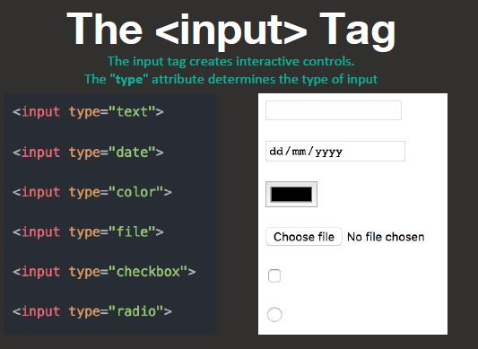

And Also we learn how to use CSS box model which contains padding, border and marign.

<h1>Objectives</h1>
1.Learn about advanced positioning in CSS
2.Relative, Absolute, Fixed

<h1>Positioning</h1>
CSS position property lets you alter the positioning scheme of a particular element by using:
<ul>
  <li>Relative Position: Moves elements around relative to where they would appear on the page</li>
  <li>Absolute Position: Offset is relative to the entire browser window instead of the original position of the element.</li>
  <li>Fixed Position Very similar to absolute EXCEPT the coordinate system is relative to the entire browser window. Fixed elements don't scroll with the rest of the page. Commonly known as sticky elements<li>
</ul>  
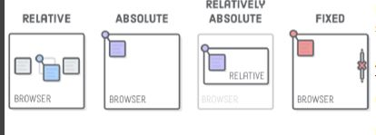

and lastly we learn about flexboxes with are:
 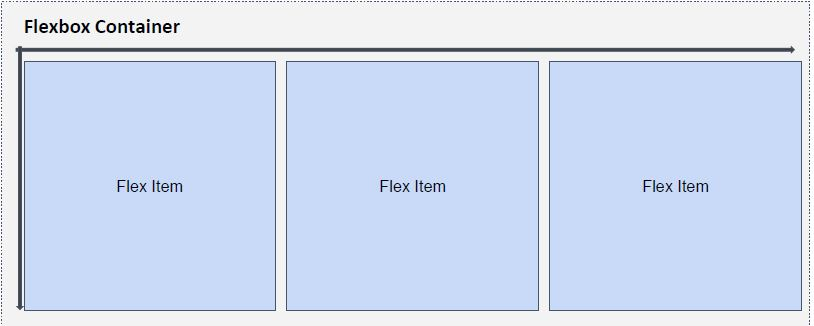

# Week 4
So week 4 lesson we are applying everything that we learn from week 1 to week 3 and putting everything together:

Which are:
<ul>
  <li>Using Responsive Images for flexible layouts</li>
  <li>Better understand Flex Layouts</li>
</ul> 

So basically, we learn how to use responsive images as it have better performance and auot-resize based on screen size.
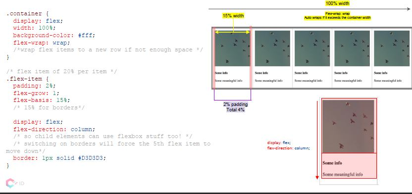

and we started on doing our assignments.

# Week 5 & 6 & 7
So week 5 & 6 lesson we learned about Javascript as js makes responsive design easier. JavaScript has become integral to the Internet experience as developers build increased interaction and complexity into their applications.

And here are some examples of js codes:
 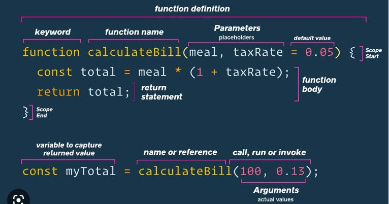

and we also learn about Object Oriented Programming which are group together a set
of variables and functions to
create a model. Used to model the real world
 

and we also learn about Document Object Model which creaates a model of the page. And the model is called a DOM tree

 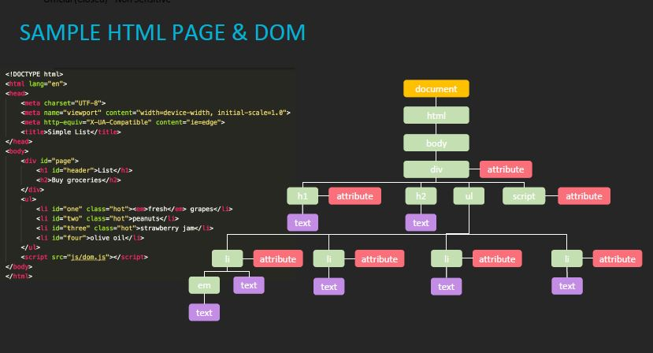

# Week 7
So week 7 we learn about the events and when u browse the web, the browser register different types of evens and the script will often.
and this are the examples of events:
 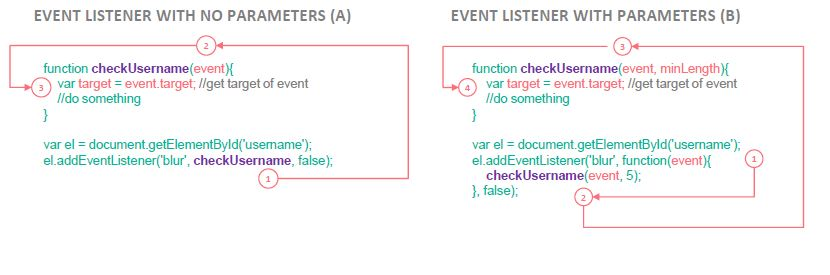

and we also learn FORMS & VALIDATION
Enhancing Interactivity the reason is because Prevent user from enter invalid inputs We have server side validation and client side validation.

One example would be:
 

and we also learn about local storage so its basically a web storage lets you store data in the browser and the data it stores can only be accessed by the domain that set the data.

Two different type of storage which are:
<ul>
  <li>local storage:  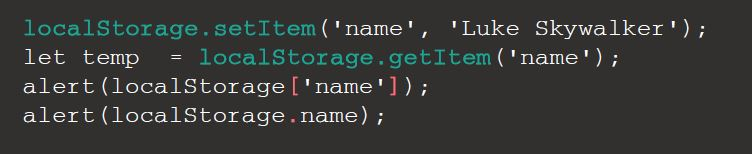</li>
  <li>Session Storage:  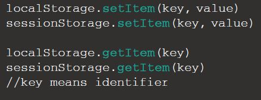</li></li>
</ul> 

# week 8
So week 8 we learn about jquery and The purpose of jQuery is to make it much easier to use JavaScript on your website. jQuery takes a lot of common tasks that require many lines of JavaScript code to accomplish, and wraps them into methods that you can call with a single line of code.

 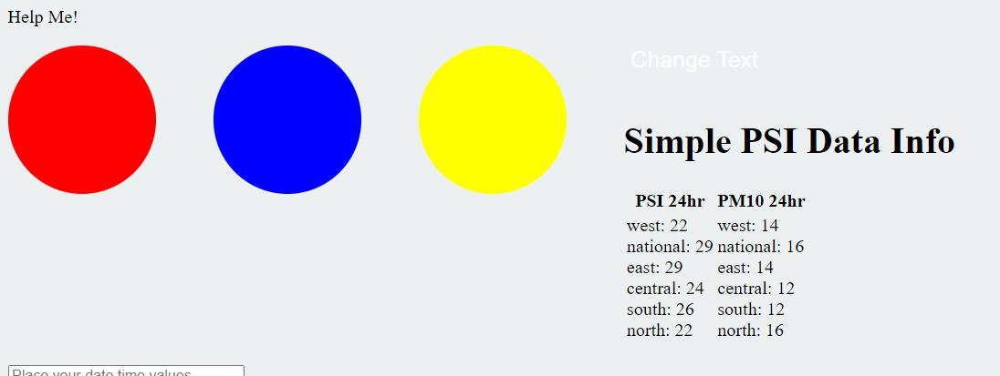

# Week 9
So week 9 we learn about bookstrap which Bootstrap has come a long way and it was developed out of “boredom” by developers who wanted a faster way to create User Interfaces and to resolve all the nooks and crannies imposed by all the various browsers and devices.

 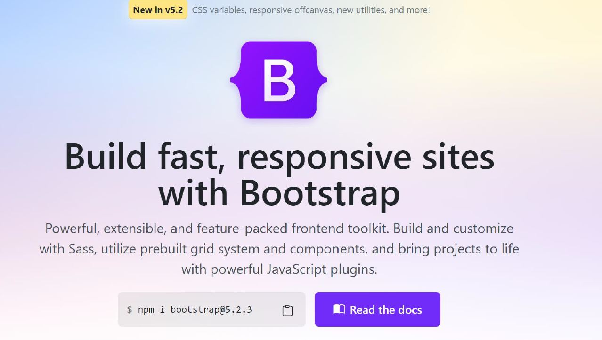